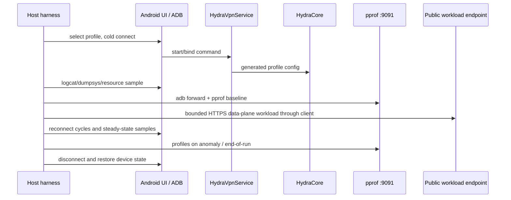

# Design: Client Protocol Soak Test

**Status:** Draft — Design approval required

## Overview

A host-side, evidence-first ADB harness will exercise the already-enabled HydraBox2 profiles one at a time. It treats configuration acceptance, transport health, data-plane results, Android lifecycle, Go pprof and device resources as separate signals. It does not change profile/server configuration and does not alter HydraCore until an observed client-side cause has a repeatable before/after measurement.

The run defaults to three cold/reconnect cycles plus a 10-minute steady-state period per eligible profile. A bounded public HTTPS workload is used in addition to existing exit lookup and URL-test signals.

## Decisions

### Serial profiles and bounded workload

- **Decision:** One active profile and one data-plane stream at a time.
- **Rationale:** Each profile may create resource-heavy core transports; parallel profiles would hide which protocol owns a CPU, memory, socket or flood-control failure.
- **Workload:** `https://speed.cloudflare.com/__down?bytes=1048576`, one 1 MiB HTTPS transfer every 30 seconds during the steady-state phase, maximum 20 MiB per profile. A failed request is evidence, not an automatic retry storm.
- **Limit:** The endpoint is public infrastructure and external behavior may vary; endpoint-related failures are classified separately unless a cross-profile client signature proves otherwise.

### Profiler handling

- **Decision:** Forward device loopback `9091` to a unique host-local port for each run after the core has started, then use Go pprof endpoints only.
- **Evidence:** `/debug/pprof/`, `goroutine?debug=1`, `heap`, `profile?seconds=30`, and `trace?seconds=5` only around a suspected stall. CPU profiles are not collected for every profile because the 30-second sampling changes the workload.
- **Security:** Store summaries and binary profiles under the evidence directory; do not print profile bodies or generated profile configuration in terminal output.

### Mobile handover

- **Decision:** Capture Wi-Fi baseline first, then conduct one explicitly logged Wi-Fi ↔ mobile-data handover per passing profile only if Android reports a usable mobile default network.
- **Rationale:** Mobile whitelist/filter state is unknown. No mobile interface or a blocked mobile data plane is an environment result, not a client verdict.

## Architecture



## Components and interfaces

### 1. Inventory collector

**Input:** Current subscription/read model on device.

**Output:** `profiles.json` with redacted tag/display name, profile protocol/type, source group, eligible flag and reason.

**Rules:** The collector never serializes subscription URLs, outbound JSON, credentials or generated config. A tag is hashed in the public report if it could identify a private server.

### 2. Scenario runner

**Input:** One inventory item and fixed timeouts.

**Steps:**
1. Confirm device baseline: package state, default network, VPN/proxy ownership and no residual core process.
2. Select the profile and issue cold connect.
3. Wait for configuration accepted plus transport-health state; separately collect UI/runtime selected route and exit lookup.
4. Execute three disconnect/cold-reconnect cycles.
5. Hold the final connection for 10 minutes and run the bounded workload every 30 seconds.
6. Capture one authorized network handover only when the device exposes a usable target network.
7. Disconnect; wait for process/service ownership release; collect final evidence.

**Timeout policy:** A phase timeout records failure evidence, attempts an orderly disconnect, and proceeds to the next profile. No arbitrary sleep/retry is used as a pass criterion.

### 3. Evidence collector

**Per run:** device fingerprint, app/APK version, HydraCore revision, profile inventory manifest, command log, environment metadata and SHA-256 manifest of evidence files.

**Per profile:**
- timestamps and durations for each scenario phase;
- filtered HydraBox logcat plus complete bounded logcat tail after a failure;
- `dumpsys` VPN/service state and `ip route` / network snapshot;
- process RSS/PSS and CPU delta samples;
- data-plane outcomes and error classification;
- pprof index/heap/goroutine snapshots when port 9091 is present; CPU/trace only on a measured suspected stall.

### 4. Analyzer

The analyzer emits one row per profile with:

| Field | Meaning |
| --- | --- |
| outcome | pass / fail / skipped / inconclusive |
| failed phase | config, health, route, workload, reconnect, handover, teardown |
| classification | client, core, server/relay, network, environment, inconclusive |
| evidence | artifact paths and timestamps |
| optimization candidate | only a repeatable client/core cause |

A candidate requires the same failure signature in at least two runs or across two affected profiles, unless it is an unambiguous client crash/leak with a direct trace.

## Data model

```json
{
  "profile": "redacted-tag",
  "protocol": "classified type",
  "cycle": 1,
  "phase": "connect|health|workload|handover|disconnect",
  "startedAt": "ISO-8601",
  "durationMs": 0,
  "outcome": "pass|fail|skipped|inconclusive",
  "classification": "client|core|server|network|environment|inconclusive",
  "evidence": ["relative/path"]
}
```

## Error handling

| Condition | Harness action | Classification |
| --- | --- | --- |
| No server/profile type available | mark skipped with inventory reason | environment |
| App/service dies mid-scenario | capture logcat, dumpsys, pprof if still reachable | client/core pending evidence |
| Core rejects config | preserve start diagnostics and profile metadata | profile/config or core |
| Transport healthy but workload fails | retain route/exit/network evidence | server/network or client pending comparison |
| 9091 absent | record unavailable; continue scenario | observability gap |
| Mobile network missing/filtered | stop handover portion; preserve network state | environment |
| Workload endpoint fails across all profiles | label endpoint/environment; do not blame protocols | external environment |

## Test strategy

### Preflight

- Confirm APK/debug build and HydraCore revision.
- Verify the pprof listener appears only after the tunnel core starts; establish `adb forward` then request pprof index.
- Inventory profiles and validate that redaction works before any run.

### Per profile

- Cold connect plus three reconnect cycles.
- 10-minute steady state with 20 bounded 1 MiB transfers maximum.
- pprof baseline/end snapshots; on anomaly capture CPU profile and short trace.
- One network-handover scenario only when mobile target is usable.

### Optimization validation

For each confirmed fix: rerun the failed scenario once before change and twice after change on the same device/network/profile. Compare phase duration, health/data-plane outcome, process resources and pprof evidence.

## Non-goals

- Server-side relay changes, subscription changes and credential changes.
- Claiming protocol security or censorship-resistance from a single device/network.
- Unbounded load generation, flooding public endpoints, or production-scale traffic benchmarking.
- Treating a missing live captcha/VK/TURN event as a passing test.

## Requirement traceability

| Design area | Requirements |
| --- | --- |
| Inventory + scenario runner | R1, R2, R3 |
| Evidence + pprof | R2, R4 |
| Analyzer + validation discipline | R5 |
