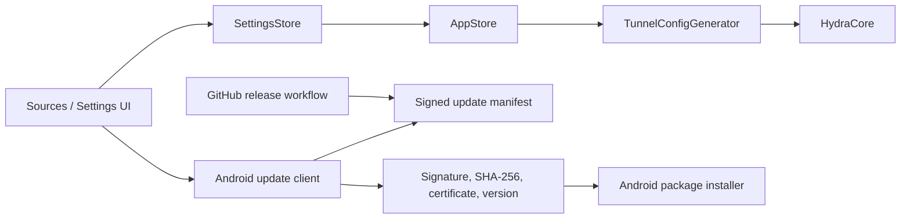

# Design: Client, release, and diagnostics controls

**Status:** Approved — 2026-09-16
**Requirements:** `requirements.md` (approved 2026-09-16)
**Decisions:** `D:/dev/.kiro/decisions/0006-client-update-trust.md`, `D:/dev/.kiro/decisions/0007-tls-fragment-contract.md`

## Overview

The change stays deliberately narrow. The subscription form reuses the existing Compose design system; the core configuration generator suppresses app-added fragmentation for Naive only; settings gain two persisted values (`updateChannel`, `pprofEnabled`); and the release workflow/client gain a signed update-manifest contract. Existing local changes are reviewed as separate commit candidates, never folded into this feature by accident.

## Architecture



### 1. Subscription import UI

`SourcesScreen` retains one `AddSourceSheet`, rather than adding a second import mechanism. The sheet keeps its draft link/name and remains visible while an import is running or fails. It receives the observable import result from the existing `ScreenState`/notice path and renders the relevant existing message close to the field. URL/paste is the primary path; file import remains a secondary action. The first-run form reuses the same form content or state contract so the two entry points cannot drift.

No parser or source-fetch semantics change.

### 2. Core-validated TLS fragmentation

`TunnelConfigGenerator.dialOptions()` currently conflates TCP dial options and TLS fragmentation by sending every `dialCapableTypes` member through the same helper. That makes Naive receive a TLS field its constructor forbids. Split the policy: TCP options keep their current applicability, while a dedicated `tlsFragmentCapableTypes` owns only app-added TLS fragment fields.

The initial core-validated set is `http`, `vmess`, `trojan`, `vless`, `anytls`, `shadowtls`, and `trusttunnel` — the transports that hand their TLS config to a stream dialer, where the bundled core wraps the connection with its fragmenter. `trusttunnel` was found late: `transport/trusttunnel/client.go:115` builds a `tls.NewDialer`, so the fragmenter does reach it, and the acceptance matrix confirms the core takes the fields. Naive passes through unchanged because the core rejects both modes. `socks`, `shadowsocks`, `mieru`, and `ssh` have no supported TLS object and never receive a synthesized one.

One working case stays uncovered: `sudoku`. Its HTTP-mask path does call `tlsConfig.Client(conn)` (`transport/sudoku/obfs/httpmask/tunnel.go:275`), but its TLS lives inside `http_mask.tls` rather than a top-level `tls`, and `dialOptions` reads only the top-level object. Covering it means rebuilding a nested object, which is not a list entry — the boundary is recorded rather than implied.

The QUIC-based transports (`hysteria`, `hysteria2`, `tuic`) are deliberately excluded, and this is the subtle part: the core **accepts** `fragment` and `record_fragment` on them without complaint, so a JSON-only or acceptance-only test would call them supported. They are not. The bundled core references its fragmenter from exactly two files — `common/tls/std_client.go` and `common/tls/utls_client.go` — and both apply it inside `Client(conn net.Conn)`, i.e. by wrapping an existing stream connection. QUIC outbounds instead pass the `*tls.Config` into their QUIC stack (`TLSConfig:` in `protocol/hysteria/outbound.go:83`, `protocol/hysteria2/outbound.go:141`, `protocol/tuic/outbound.go:72`), which drives `crypto/tls` directly and never calls that wrapper. Fragmentation there is inert, not broken. By contrast `vless` (`protocol/vless/outbound.go:69`), `vmess` (`:63`), and `anytls` (`protocol/anytls/outbound.go:78`) route through `tls.NewDialer`, which does reach the wrapper.

This preserves source JSON and does not disable fragmentation globally. It does stop the product from promising a behaviour it cannot deliver on three transports.

The contract has two layers. Kotlin generator tests assert exact JSON fields for both modes and every type. A deterministic core-contract fixture then serializes each complete generated configuration and asks the bundled core's `CheckConfig`/`HydraCoreValidateConfig(..., "local")` constructor to accept it. Fixtures use minimal synthetic data and `.invalid` hosts, so no credential or network is needed. A mixed catalog catches drift across the full current type set.

Constructor validation proves that HydraBox's generated configuration is accepted by the bundled core. It cannot alone prove that every remote protocol fragments live traffic: acceptance and effect are different claims, and for QUIC transports acceptance is a false positive. The verified boundary of this change is therefore: the bundled core rejects Naive outright; it accepts fragmentation for seven stream transports and applies it there; it accepts but ignores it for four QUIC transports, which is why HydraBox stops emitting it for them.

The matrix must run with the tags the client core actually ships with — `release/DEFAULT_BUILD_TAGS`, which carries `with_quic`, `with_utls`, `with_sudoku`, `with_trusttunnel`, and `with_naive_outbound`. A run without them cannot construct the gated outbounds and either fails or quietly under-tests. `with_naive_outbound` additionally pulls the cronet stack, which does not build on a desktop host: the Naive refusal is therefore asserted by a test that skips only on the explicit "not included in this build" message, and by the source check in `protocol/naive/outbound.go`.

### 3. pprof setting

`Settings`/`SettingsCodec` gain `pprofEnabled: Boolean`, persisted with default `false`. `AppStore.generateConfig()` supplies `TunnelInput.debugListen = "127.0.0.1:9091"` only when the setting is enabled; otherwise it supplies an empty value. `TunnelConfigGenerator` already emits `experimental.debug.listen` only for a non-empty value, so no core API change is needed.

The Settings UI presents this as a diagnostics switch with a loopback/port explanation and an explicit “takes effect after reconnect” hint. The first delivery exposes the switch in debug builds only, matching the existing shipped-build prohibition; in all cases it stays loopback-only and disabled by default. The design must reuse the existing reconnect-required setting notice rather than invent a second lifecycle path.

### 4. Update channels and trusted install

A branch is build input, not an update protocol. The UI offers two fixed values:

```kotlin
enum class UpdateChannel { STABLE, CANARY }
```

They are persisted in `SettingsStore`; no user-entered branch names or arbitrary URLs are accepted. The default is `STABLE`.

The release workflow publishes a per-channel signed manifest at a **fixed path on a known branch**, fetched over HTTPS from the repository's raw endpoint (ADR `0009`). The address is constant and carries no version, tag or channel decision of its own: everything that decides whether the document may be used lives inside the signed bytes, because a URL is a place, not a claim. The alternative — asking the releases API — would drag GitHub's response shape and rate limits into the client, and the "latest release" address ignores prereleases, which is exactly the distinction that keeps 1.x's channel from being replaced by a 2.x build.

Consequence for the release ritual: the same workflow run that uploads the APK must also update that file, or the release exists without being discoverable. A CDN cache may serve a slightly older manifest; that is harmless because the document is signed and the client compares version codes. Its wire format is versioned JSON and contains only immutable update identity:

```json
{
  "schema": 1,
  "channel": "canary",
  "versionCode": 201,
  "versionName": "2.0.0-alpha2",
  "releaseTag": "v2.0.0-alpha2-canary",
  "apkUrl": "https://.../hydrabox.apk",
  "sha256": "lowercase hex digest",
  "certificateSha256": "uppercase hex digest",
  "keyId": "update-2026-01",
  "signature": "base64url detached signature"
}
```

The existing `HYDRABOX_UPDATE_ED25519_PRIVATE_KEY`, key-id, and public-key configuration from the release pipeline are the intended signing/verification source; implementation must confirm their actual formats before use. Stable and Canary have separate immutable tags/assets and manifests. The workflow is manually triggered against the intended ref and receives a channel input; it refuses a mismatch between input channel and triggering ref. `canary` therefore maps to the current `origin/canary` branch, while Stable maps to the release branch defined by the workflow policy.

The signature is checked **inside the bundled core**, not in the client (ADR `0008`): Android exposes Ed25519 through `java.security.Signature` only from API 33 and this application supports API 26. The client hands the core the manifest's exact bytes, the detached signature, the key identifier and the pinned key list, and parses the document only after the core reports it verified. Re-serialising the document before verifying it is the mistake this ordering exists to prevent: two different documents would then share one signature.

The Android update client performs this sequence:

1. Load the selected allowlisted channel and fetch its signed manifest from the fixed address with bounded size and timeouts.
2. Ask the core to verify the detached Ed25519 signature over the exact received bytes against the pinned key list; reject an unknown key identifier, an unsupported schema, or a mismatched channel.
3. Reject a manifest unless `versionCode` is greater than the installed code.
4. On explicit user action, download the APK to app-private storage with bounded size and SHA-256 verification.
5. Verify the APK signer certificate against the manifest and the app’s trusted certificate identity.
6. Launch the Android package installer intent; retain no elevated install privilege and surface Android denial/cancellation.

No download or installation occurs merely by opening Settings or by a background check.

## Components and interfaces

| Component | Change | Responsibility |
| --- | --- | --- |
| `SourcesScreen` / onboarding import | Shared form content and retained form state | Consistent import UX; no data parsing |
| `Settings`, `SettingsCodec`, storage | `updateChannel`, `pprofEnabled` | Persist safe defaults and validate enum values |
| Settings projection/UI | Update channel selector, pprof switch, explicit state/errors | Human-visible control and reconnect guidance |
| `AppStore.generateConfig` | Gate `debugListen` by persisted boolean | Loopback pprof config only when opted in |
| `TunnelConfigGenerator` | Exclude Naive from fragment/dial override eligibility | Prevent core rejection while retaining supported fragmentation |
| Update client/repository | Fetch, verify, compare, download | Trust boundary; no unverified artifact reaches installer |
| Android installer adapter | Build install URI/intent and map its result | Platform-specific installation handoff |
| `.github/workflows/android-release.yml` | Channel-aware tag/assets and signed manifest | Produce immutable, verifiable release metadata |

## Errors and recovery

| Condition | Product response | Safety behavior |
| --- | --- | --- |
| Invalid subscription URL/file | Retain safe draft and show existing specific source failure | Do not erase input or create a source |
| Naive + either fragment mode | Generate Naive unchanged | Do not disable fragmentation for other supported outbounds |
| pprof port cannot bind | Surface start failure/reconnect result | Do not fall back to a non-loopback address or another port |
| Unknown/malformed update manifest | “Update metadata could not be verified” | Stop before APK download/install |
| APK hash/certificate/signature mismatch | “Update could not be verified” | Delete partial artifact; stop install |
| Same/lower version | “No update available” | Never invoke installer |
| Android declines installer | State that installation was not completed | Keep current app intact |

## Testing strategy

- **Fragmentation contract tests:** two modes across every explicit TLS-capable type; Naive and non-TLS negative cases retain source JSON; one mixed catalog per mode validates through the bundled core constructor without network.
- **Core primitive evidence:** retain/execute the existing core TLS-fragment unit tests separately; do not overstate constructor validation as end-to-end wire proof.
- **Settings unit tests:** missing/malformed values load as `STABLE` and pprof false; save/load round-trip both values.
- **UI tests:** subscription form preserves draft after failed import, exposes URL/file actions through semantics, and shows busy/error states; Settings exposes selected channel and pprof/reconnect copy.
- **Update unit tests:** reject malformed/unknown-channel/invalid-signature manifests, lower version codes, bad APK hash, and certificate mismatch; accept only a valid higher signed update.
- **Workflow check:** fixture or script validates a channel manifest against the public key and asserts tag/ref/channel consistency before publish.
- **Focused build:** compile relevant Android and shared modules after each slice; install/update flow requires a device test with a throwaway signed APK.

## Out of scope / non-goals

- Auto-download, silent install, arbitrary branches/URLs, or changing 1.x release behavior.
- Network exposure of pprof beyond `127.0.0.1:9091`.
- Changing provider subscriptions or Naive protocol semantics.
- Committing the unfinished protocol-soak harness, formatter-only diffs, `.pi/` artifacts, or unrelated draft specs as part of this feature.
