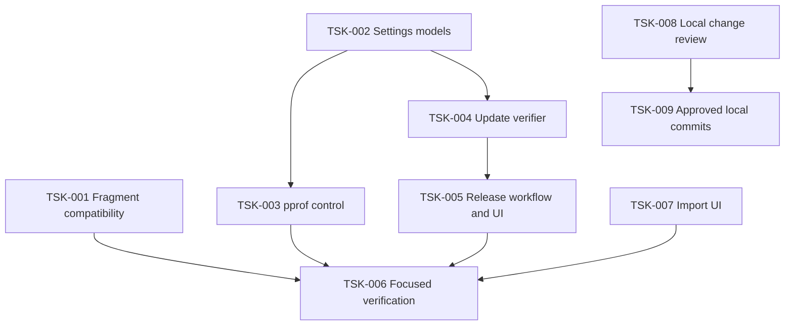

# Tasks: Client, release, and diagnostics controls

**Status:** Draft — Tasks approval required
**Requirements:** `requirements.md`
**Design:** `design.md`

## Dependency graph

## Progress

| Task | Status | Evidence |
| --- | --- | --- |
| TSK-001 | ✅ Готово | Kotlin `jvmTest` зелёный; ядро: 34 PASS / 2 SKIP |
| TSK-002 | ✅ Готово | `:core:settings:jvmTest` — BUILD SUCCESSFUL |
| TSK-003 | ✅ Готово | `:ui:app` compile + `:core:projection:jvmTest` — BUILD SUCCESSFUL |
| TSK-004 | ⏳ 3 из 6 срезов | срезы 1–3 закоммичены, 4 написан, 5–6 впереди |
| TSK-005 | ⚪ Pending | ждёт срезов 1–6 и второго релиза ядра |
| TSK-006 | ⬚ Pending | — |
| TSK-007 | ⬚ Pending | — |
| TSK-008 | ✅ Готово | разбор ниже, коммиты 73f2fb5…a08cdbc |
| TSK-009 | ✅ Частично | 6 локальных коммитов; пуш — отдельным запросом |

## Tasks

### TSK-008 / TSK-009 — итог разбора дерева

| Путь | Вердикт | Причина |
| --- | --- | --- |
| `core/config/.../TunnelConfig.kt` + тест | включено | `73f2fb5` — политика фрагментации |
| `ui/app/.../HomeScreen.kt` | включено | `7643fad` — разделитель маршрута |
| `platform/android/.../HydraVpnService.kt` | включено | `be7d11f` — возврат уведомления |
| `ServersScreen.kt`, `States.kt`, оба `strings.xml` | включено | `a08cdbc` — полоса устаревания |
| PNG-артворк + `ic_launcher_foreground.xml` | включено | `c8dda62` — safe zone |
| `.gitignore` | включено | `8abe519` — `.pi/` в игнор |
| `core/subscription/.../SubscriptionParser.kt` | исключено | добавлены только пустые строки в `when`, семантики нет |
| `platform/android/build.gradle.kts` | исключено | те же выражения переразбиты по строкам, семантики нет |
| `.pi/` | исключено | агентские транскрипты; теперь в `.gitignore` |
| `tools/` | исключено | незаконченный harness протокольного прогона |
| `.kiro/` | исключено | по решению владельца спеки живут вне git |
| сабмодуль `hydracore` | коммиты локально | `b5cb276c8` (контракт фрагментации) + `b844297fa` (recovering) на ветке `vk-fragment-recovery-fix` |

Прим: пин сабмодуля в родителе НЕ двигался — `platform/android/build.gradle.kts:186` требует, чтобы HEAD сабмодуля совпадал с опубликованным provenance. То есть фикс ядра станет доступен приложению только после пуша ветки ядра и выпуска релиза ядра.

- [x] **TSK-001 — Validate and enforce TLS-fragment capability**
  - **Requirement:** R4
  - **Deliverables:** Separate `tlsFragmentCapableTypes` from generic dial options; preserve Naive/non-TLS source JSON; add minimal synthetic fixtures for every current outbound type.
  - **Tests:** Kotlin generator matrix (15 типов × `record`/`fragment`); Go core-contract matrix (10 типов × control/record/fragment) через `CheckConfig`; negative-тест на отказ Naive.
  - **Acceptance:** Достигнуто — семи потоковым транспортам поля выдаются, Naive/нет-TLS/QUIC — нет; полный каталог не рушится.
  - **Факт:** `:core:config:jvmTest` — `BUILD SUCCESSFUL`; `go test -tags "<release/DEFAULT_BUILD_TAGS минус with_naive_outbound>" ./experimental/libbox` — 34 подтеста, все PASS, 2 SKIP по Naive.
  - **Границы:** итоговый набор — `http`, `vmess`, `trojan`, `vless`, `anytls`, `shadowtls`, `trusttunnel`. Фрагментер ядра оборачивает соединение только в `common/tls/std_client.go:79` и `common/tls/utls_client.go:87`, то есть работает и для uTLS/REALITY. Единственный отказ по типу — `protocol/naive/outbound.go:76`; локально Naive не собирается (cronet), поэтому покрыт skip-on-explicit-message плюс исходником. QUIC-транспорты (`hysteria`, `hysteria2`, `tuic`, `masque`) поля принимают и игнорируют, поэтому им не выдаются. Платформенные движки (`apple`, `windows`) фрагмент отвергают (`common/tls/system_client.go:47`), но на Android нерабочие сами по себе. Непокрытый работающий случай — `sudoku`: TLS внутри `http_mask.tls` (`transport/sudoku/obfs/httpmask/tunnel.go:275`), генератор туда не достаёт. Приёмка конструктором не равна подтверждённому эффекту в живом соединении.
  - **Матрица обязана идти под тегами `release/DEFAULT_BUILD_TAGS`** — иначе QUIC и остальные транспорты молча выпадают из проверки.

- [x] **TSK-002 — Persist diagnostics and update settings**
  - **Requirement:** R2, R3
  - **Deliverables:** `UpdateChannel` (`STABLE`, `CANARY`) и `pprofEnabled` в `Settings`/`SettingsCodec`.
  - **Факт:** `:core:settings:jvmTest` — `BUILD SUCCESSFUL`. Тест `the update channel fails closed and the profiler is opt-in` покрывает дефолты, неизвестное значение канала (`nightly` → STABLE) и round trip.
  - **Граница:** значение канала пока сохраняется, но не вынесено в UI — ручка без апдейтера была бы мёртвой (TSK-005).

- [x] **TSK-003 — Wire debug pprof to the persisted switch**
  - **Requirement:** R3
  - **Deliverables:** `debugListen` в `AppStore.generateConfig()` только при `BuildConfig.DEBUG && settings.pprofEnabled`; поле `pprofAvailable` в проекции; `onSetPprof` через `reconnectAware`; тоггл в «Диагностике» только когда `pprofAvailable`.
  - **Факт:** `:ui:app:compileDebugKotlinAndroid` + `:core:projection:jvmTest` — `BUILD SUCCESSFUL`.
  - **Почему reconnect:** ядро читает `debug.listen` при старте, поэтому обещание «применится сразу» было бы ложью.
  - **Граница:** модуль `:platform:android` локально не компилируется (`verifyLibboxProvenance`), поэтому правка `AppStore`/`RuntimeControlActivity` проверена только чтением; полная проверка — в CI по решению владельца.

### TSK-004 — доверенный апдейтер: срезы

Решение о том, где проверять подпись, зафиксировано в ADR `0008`; о том, откуда берётся манифест — в ADR `0009`.

| # | Срез | Состояние | Факт |
| --- | --- | --- | --- |
| 1 | Модель манифеста и его форма | ✅ `d11a9d1` | `:core:update:jvmTest` зелёный |
| 2 | Проверка подписи в ядре | ✅ `5a39684a2` | 5 тестов / 7 подтестов PASS |
| 3 | Решение «ставить или нет» | ✅ `33343a6` | `:core:update:jvmTest` зелёный |
| 4 | Бридж ядро → Kotlin | ✅ `e42d4d9` | после релиза ядра дыра закрыта — см. ниже |
| 5 | Загрузка APK, хеш, сертификат, установщик | ✅ `8d7bacc` + `ac4a3ac` | типизация поймала `File.length`; проверка диалога — только устройство |
| 6 | Подпись манифеста и файл в ветке (workflow) | ✅ `48d47f4` | поведение проверяется только настоящим релизом |
| 7 | Проекция и экран выбора канала | ✅ `7477d58`, `13d0106`, `ab142dc` | `:ui:app` зелёный |

**Релиз ядра и пин:** опубликован `…hydracore.12-debug.11` (`sourceCommit=855a8ac61`, ключ `hydracore-release-1`). Пин обновлён двумя коммитами: `2eb2f24` (провенанс на новый AAR, `sha256:abe9f014…`) и `10a4e61` (указатель сабмодуля `5171722 → 855a8ac`). Контракт и upstream не менялись — правка ядра их не затронула.

Граница, которая была: локальный AAR собран из старого ядра, и `hydraCoreVerifyUpdateManifest` в нём отсутствовал. После гидрирования нового артефакта эта ссылка разрешается, и модуль платформы типизируется целиком.

- [ ] **TSK-004 — остаток**
  - Проверка на устройстве: диалог системного установщика, смахивание уведомления, иконка в шторке.
  - Интеграционный прогон TSK-006.

Что срезы 1–3 гарантируют своим порядком: документ без поручительства **не разбирается**, релиз чужого канала **не сравнивается** с установленным, и только проверенный, свой и строго новее становится тем, что можно ставить. Равная или младшая версия — не ошибка, а «нечего ставить».

Граница: без **второго релиза ядра** (с верификатором) срезы 4–5 работать не начнут — первый выпуск (`debug.9`) несёт только фикс отвала.

- [ ] **TSK-005 — Опубликовать и показать каналы**
  - **Requirement:** R2, ADR `0009`
  - **Deliverables:** релизный workflow получает вход канала, сверяет его с веткой, подписывает манифест приватным ключом и обновляет файл канала в известной ветке; в настройках — выбор Stable/Canary, проверка, «доступна версия X» и установка.
  - **Acceptance:** релиз канала canary находится только на canary; установка требует явного действия человека.

- [ ] **TSK-006 — Run integration checks and device proof**
  - **Requirement:** R2, R3, R4
  - **Deliverables:** Run focused shared/Android tests and module builds; use a throwaway signed APK on a device for the installer handoff; record commands/results without secrets.
  - **Acceptance:** All automated checks are green and the device evidence distinguishes manifest validation from Android installer approval.

- [~] **TSK-007 — Rework subscription import presentation**
  - **Requirement:** R1
  - **Deliverables:** шит добавления подписки больше не закрывается на нажатии: держит черновик ссылки и имени, показывает причину отказа внутри себя и закрывается только по `Notice.SOURCE_ADDED`. Отступы приведены к принятым в приложении (`spacing * 2`).
  - **Факт:** `:ui:app:compileDebugKotlinAndroid` — `BUILD SUCCESSFUL`.
  - **Найдено:** комментарий над шитом обещал сохранение черновика, а код закрывал шит сразу — слова и поведение расходились; теперь совпадают.
  - **Что осталось:** автотесты UI (семантика, paste/file, busy, провал с сохранённым черновиком) не написаны; визуальная оценка «вписался ли в стиль» — за владельцем, я её подтвердить не могу.

- [x] **TSK-008 — Classify existing worktree changes**
  - **Requirement:** R5
  - **Факт:** таблица выше; решения приняты владельцем (спеки вне git, `.pi/` в игнор, хвосты исключены).

- [x] **TSK-009 — Create approved local commits**
  - **Requirement:** R5
  - **Факт:** 11 коммитов в приложении поверх `origin/canary`, из них последний — принятый проход форматтера; пуша нет.
  - **Граница:** пуш и релизные действия — только по отдельному запросу владельца.
