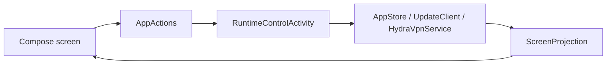

# Design: устойчивость и ясность UX

**Status:** Approved — 2026-09-19
**Requirements:** `requirements.md` (approved 2026-09-19)

## Overview

Меняем существующие точки управления без новых библиотек и без нового слоя архитектуры. Главный принцип: операция имеет собственный результат и не меняет состояние несвязанных строк. UI использует уже существующие `ScreenState`, `AppActions`, `AppStore`, `UpdateClient` и Compose-компоненты.



## Component design

### 1. Ping: state isolation per tag (R1)

Дефект не в скорости sweep и не в выбранной concurrency: один target может распространить failure на все строки. Контракт — независимое состояние каждого tag.

- При новом ping сразу перевести все выбранные tags в `checking`. Старые RTT не подменяются «не отвечает» до собственного исхода target.
- Каждый target сам проходит `checking → RTT` либо `checking → не отвечает`. Timeout, connection error и exception обрабатываются у этого target и не отменяют loop, не сбрасывают соседние tags и не публикуют им failure.
- Убрать sweep-wide deadline как источник группового состояния. Оставить индивидуальные timeouts каждого вызова.
- Только новый ping, Stop или смена сети инвалидируют весь sweep. Epoch/cancellation guard запрещает публикацию результата уже отменённого sweep.
- Сохранить URL-test running-core и STUN TURN-edge разными измерениями; RTT TURN-edge не называть RTT туннеля.
- Concurrency не входит в контракт: допустим существующий последовательный запуск или bounded параллелизм, если оба сохраняют указанные переходы и не добавляют новую сложность.

**Required sequence:** `A/B/C: checking` → `A: 35 ms` → `B: не отвечает` → `C: 58 ms`; в каждый момент изменяется только закончившийся tag.

### 2. Строка сервера: название выше диагностики (R2)

`ServerEntry` сейчас передаёт `latencyLabel(server)` в trailing slot `ServerRow`, рядом с именем. Минимальная правка — передать диагностику через `detail`, а trailing оставить только для spinner и selected check.

- Название остаётся однострочным с ellipsis.
- RTT, stale и TURN-edge подпись занимают supporting line под названием; длинный текст ограничивается обычным overflow без наложения.
- `ServerRow` и общий `HydraRow` не меняются, если supporting line уже даёт нужную геометрию.

### 3. Обновления: check → explicit download → install (R3)

`RuntimeControlActivity.onCheckUpdate` уже проверяет подписанный manifest, но затем сразу вызывает `UpdateClient.startDownload`. Этот вызов переносится в новое действие `onDownloadUpdate`.

| Action | Effect |
| --- | --- |
| `onCheckUpdate` | Проверяет manifest и публикует `availableVersion`; APK не скачивает. |
| `onDownloadUpdate` | Берёт `pendingUpdate`, стартует `DownloadManager` и обновляет `UpdateSummary.downloading`. |
| `onInstallUpdate` | Не меняется: проверяет SHA-256 готового APK и открывает системный installer. |

`HomeScreen`/строка обновления показывает «Скачать» только при найденной версии и отсутствии готовой/идущей загрузки. Ошибка проверки и отсутствие обновления не создают download id.

### 4. Подписки: убрать ложную загрузку и лишние действия (R4–R5)

- В `SourcesScreen` удалить верхний `LoadingRows(1)`, который появляется под заголовком при любом `busy.source`. Существующая кнопка refresh остаётся единственным индикатором операции; карточки не исчезают.
- Удалить файловый import вертикально: кнопку `sources_add_file`, `AppActions.onAddSourceFromFile`, `OpenDocument` launcher, обработку чтения и мёртвые strings/tests. URL import остаётся.
- Заменить rename-only intent на `onEditSource(id, name, link)`. `RenameDialog` становится edit dialog с двумя полями. Сохранение выполняется одной store-операцией: сначала валидировать и загрузить новый source тем же `SubscriptionFetcher`, затем atomically заменить старую подписку. При ошибке ничего не менять.
- Поскольку `SubscriptionId` выводится из URL, смена URL должна мигрировать запись через новый id, а не просто перезаписать URL под старым id. Сохраняются имя и enabled-state; source document, metadata, cache/failure и URL старого id удаляются только после успешного fetch/parse нового источника.
- Удалить `HydraIcons.Shield` из `SourceCard`; encrypted state не теряется в storage, только не занимает UI.
- В `ProtocolBadges` заменить пробел перед количеством на `×`, например `VLESS ×2`; без новых badge styles.
- Ввести в `SubscriptionSummary` `identifiers: List<SubscriptionIdentifier>` только из явного allow-list передаваемых не-секретных значений. `AppStore` проецирует существующие metadata и identity values в этот list; tokens, ключи, URL с query-secret и неизвестные поля не передаются в UI. Карточка detail показывает список только когда он не пуст.

### 5. Оформление: три варианта без HydraBox brand theme (R6)

Переиспользуется существующий `Appearance.SYSTEM/LIGHT/DARK`; `dynamicColour` удаляется как отдельная настройка и отдельный блок UI.

| Appearance | Схема |
| --- | --- |
| `SYSTEM` | Системные динамические цвета Android; на устройстве без них — platform fallback. |
| `LIGHT` | Новая нейтральная фиксированная светлая M3 palette. |
| `DARK` | Новая нейтральная фиксированная тёмная M3 palette. |

`HydraTheme` получает `Appearance`, а не `dark + dynamicColour`, и выбирает одну схему. Старая запись настроек безопасно декодируется: legacy `dynamicColour=true` → `SYSTEM`; legacy brand `LIGHT`/`DARK` → соответствующая нейтральная fixed palette; legacy brand `SYSTEM` → `SYSTEM`. После следующего сохранения выдаётся только новое представление.

### 6. Launcher icon: provided Flow asset (R7)

`HydraBox_Flow_icon_1024.png` — готовый квадратный растровый знак, но его содержимое почти занимает adaptive canvas. Нельзя положить его в foreground без inset: системная mask обрежет края.

- Сохранить исходник как traceable input вне Android resource tree.
- Сгенерировать density-specific foreground PNG с safe-zone не меньше текущего Android adaptive-contract; знак масштабировать с полями, не растягивать.
- Обновить launcher и round adaptive XML на новые foreground resources; создать monochrome layer из силуэта для Android 13+.
- Не трогать `ic_hydrabox_status`: это отдельная монохромная иконка шторки.

### 7. Home route, repeat connect и leading flags (R8–R11)

**Полная detail-строка только там, где она нужна.** `FactRow` в design-system сейчас жёстко задаёт `detail.maxLines = 1` и `Ellipsis`. Добавляем opt-in для нескольких строк и включаем его только у Home → «Маршрут»: фраза «Выбирается сервер с наименьшей задержкой» становится полной, но остальные compact readings не меняют геометрию.

**Один lifecycle-intent на переход.** `Instrument()` уже получает `HomeAction`. После первого connect тот же aperture меняет `CONNECT` на `CANCEL`, хотя ниже уже есть явная secondary «Отмена». Его действие фиксируется так:

| Home state | Нажатие central aperture |
| --- | --- |
| `Idle` / terminal error | начать подключение |
| `Connecting` / `Reconnecting` | disabled; новый intent не посылается |
| `Connected` | явный Stop |

Это убирает путь, где новый tap во время старта превращается в Stop; secondary Cancel остаётся доступной. Никакой новой очереди, таймера или debounce-библиотеки не вводится: один existing-state guard и UI regression test.

**Тег — ключ, не текст.** `ScreenProjection.resolvedAuto()` должен хранить core outbound id отдельно от display name: `withLatency()` продолжает искать latency по id, а Home показывает `ServerRef.displayName`, найденный в `model.servers`. Для неизвестного id supporting text не показывается: raw tag не является пользовательским именем.

**Флаг без новой модели.** На устройстве текущие конфигурации уже приходят как title с ведущей парой regional-indicator emoji (`🇫🇮 AnyTLS`), а `ServerRow` параллельно рисует generic server glyph. Небольшой pure helper отделяет только валидную ведущую пару от title. `ServersScreen` передаёт флаг в `ServerRow` leading slot; тот показывает emoji вместо glyph. Без флага вызов и UI остаются прежними.

## Data contracts

```kotlin
data class SubscriptionIdentifier(
    val label: String,
    val value: String,
)

// Existing projection gains only this field.
data class SubscriptionSummary(
    // existing fields...
    val identifiers: List<SubscriptionIdentifier> = emptyList(),
)
```

`onEditSource` replaces only `onRenameSource`; `onDownloadUpdate` is added beside `onCheckUpdate` and `onInstallUpdate`. Other module APIs remain internal unless a compiler-proven cross-module caller requires visibility.

## Error handling

| Situation | User-visible result | State protection |
| --- | --- | --- |
| Один ping timeout | Ошибка только этой строки | Другие outcomes не сбрасываются. |
| Новый ping/смена сети/stop | Старые результаты не публикуются | Epoch/cancellation guard. |
| Update manifest unavailable/invalid | Явное сообщение, download не начат | `pendingUpdate` очищен. |
| Download fails | Ошибка download с повтором | Проверка/installer не запускаются. |
| Edit URL invalid/unreachable | Ошибка рядом с формой | Старые запись и URL не меняются. |
| Unknown/secret subscription metadata | Не показывается | Не пересекает projection boundary. |

## Testing strategy

- `OfflineSweepTest`: A/B/C переходят в `checking` при старте; timeout/exception B не меняет A/C; A и C публикуют RTT независимо; cancellation, network change и новый epoch не публикуют stale outcomes. Тест не привязан к concurrency.
- `ServersScreen`/design render test: длинные title + RTT/stale занимают две строки без overlap.
- `UpdateDownloadTest`: `onCheckUpdate` не вызывает `startDownload`; download начинается только по `onDownloadUpdate`; install всё ещё требует hash verification.
- `AppStore` tests: URL edit success migrates state; invalid/fetch failure leaves old subscription intact; only allow-listed identifiers reach projection.
- UI tests: file-import action, shield и legacy brand selector отсутствуют; `VLESS ×2` отображается.
- Android resource build plus manual device check: adaptive icon is intact in launcher/settings/installer.

## Decisions record

Канонический meta-layer CLI восстановлен по пути `D:\dev\scripts\decisions.mjs`; копию в HydraBox2 не создаём, чтобы не дублировать журнал. Принятые решения:

- `.kiro/decisions/0017-offline-sweep-isolation.md` — исходная изоляция offline sweep.
- `.kiro/decisions/0021-failure-isolation-over-sweep-speed.md` — уточнение владельца: failure isolation важнее скорости, concurrency не контракт.
- `.kiro/decisions/0018-explicit-update-download.md` — check отделён от download.
- `.kiro/decisions/0019-atomic-subscription-url-replacement.md` — атомарная смена URL.
- `.kiro/decisions/0020-appearance-three-schemes.md` — три схемы оформления.

Все записи прошли `review` 6/6 и `approve`.

## Design checklist

- [x] R1–R7 покрыты.
- [x] Новые зависимости и новые модули не вводятся.
- [x] Ошибки и отмена имеют явную модель.
- [x] Тесты привязаны к рисковым изменениям.
- [x] Решения записаны через required decisions CLI.
